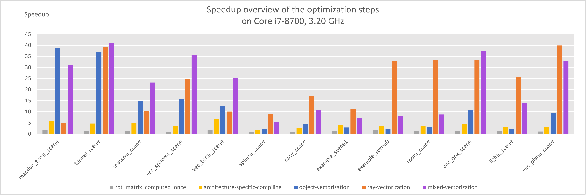

# Sphere Tracer



C implementation of a sphere tracer optimized for maximal single-core performance.
See the [project report](07_report.pdf) for detailed information and results.

This is our submission for the course project in the Advanced Systems Lab at ETH Zurich.

The sphere tracer supports:
- Shadows
- Rotations
- Specular & mirror reflections
- Anti-aliasing
- Multiple light sources
- Five different objects: 
   - Box
   - Sphere
   - Torus
   - Box-frame
   - Plane
   
# Building

`make spheretrace`
to build the sphere tracer.

`make test`
to build the test runner.


# Executing

## Sphere Tracer

The sphere tracer can run in 4 different modes: 
   - ray: perform ray-vectorization optimizations
   - obj: perform object-vectorization optimizations
   - mixed: perform both ray and object vectorization
   - auto: automatically use most promising optimization technique
   
See [project report](07_report.pdf) for more information on the optimization methods.

To run the sphere tracer on a scene *test_scenes/scene.json*, run:

```
./spheretrace -s scene -m [ray|obj|mixed|auto]
```

## Tests
In addition to the normal sphere trace application, it's also possible to evaluate the sphere tracer
on provided test scenes. For that, add all your test cases inside the `test_scenes/` directory and add reference solutions inside `reference/`

To run all tests: 

```
./test -m [ray|obj|mixed|auto]
```

It's also possible to evaluate on a subset of scenes, try

```
./test -s scene1,scene2,scene3 -m [ray|obj|mixed|auto]
```

The rendered scenes can be found in `out/`
